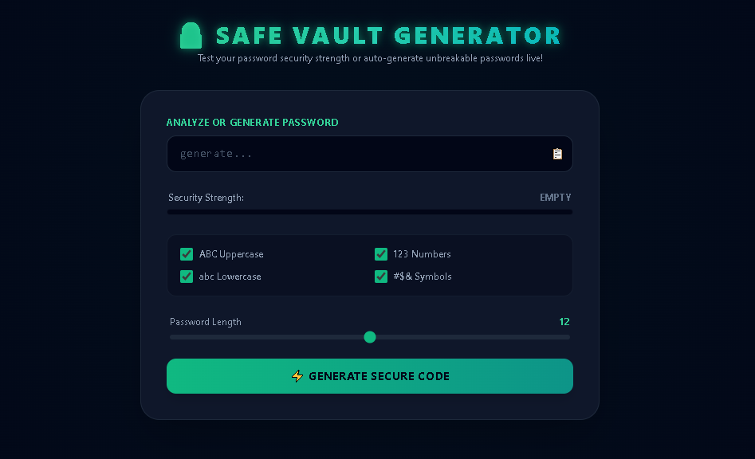

# 🔐 Secure Password Vault Generator

A security-focused, lightweight password generator built with **HTML5, Tailwind CSS, and Vanilla JavaScript**.

The tool generates clean, human-readable passwords while providing a **live password strength analyzer** to help users understand the strength of the generated password.

## 🌐 Live Demo

👉 **[View Live Demo](https://uh-digital.github.io/secure-password-vault-generator/)**

## 📸 Preview



## ✨ Features

- 🔐 **Human-Readable Secure Passwords**
  - Generates memorable and pronounceable password combinations using words, numbers, and symbols.
  - Avoids commonly confusing characters such as `0`, `O`, `l`, and `I`.

- ♾️ **Unlimited Password Generation**
  - Generate new password variations whenever needed without an operation limit.

- 📊 **Live Password Strength Meter**
  - Dynamically analyzes password strength and displays:
    - Weak ⚠️
    - Medium ⚡
    - Strong 💪

- 🎛️ **Custom Password Controls**
  - Configure password requirements using:
    - Uppercase letters
    - Lowercase letters
    - Numbers
    - Symbols
  - Adjust password length from **8 to 16 characters**.

- 📋 **One-Click Copy**
  - Copy the generated password directly to the clipboard.

- 🔔 **Custom Toast Notifications**
  - Glassmorphic notifications provide instant feedback when a password is generated or copied.

- 📱 **Responsive Interface**
  - Designed to work across different screen sizes using Tailwind CSS.

## 🛠️ Tech Stack

| Technology | Purpose |
|---|---|
| HTML5 | Page structure |
| Tailwind CSS | Styling and responsive UI |
| Vanilla JavaScript | Password generation, strength analysis, DOM interactions |

## ⚙️ How It Works

1. Choose your preferred password constraints.
2. Select the desired password length between **8 and 16 characters**.
3. Click **⚡ Generate Secure Code**.
4. The generator creates a human-readable password based on the selected settings.
5. Use the clipboard button `📋` to copy the password.
6. The strength meter provides live feedback about the generated password.

## 🎯 Project Highlights

This project focuses on building a clean, responsive frontend experience while implementing:

- Dynamic password generation
- Password strength analysis
- User-controlled generation settings
- Clipboard interactions
- Real-time UI feedback
- Responsive Tailwind CSS layouts

## 📂 Project Structure

```text
secure-password-vault-generator/
│
├── index.html
└── assets/
    └── screenshot.png
